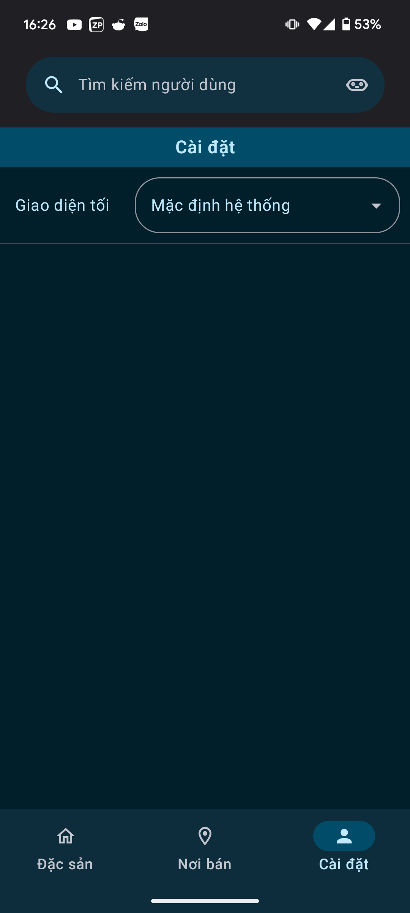

<!-- Improved compatibility of back to top -->
<a name="readme-top"></a>

<!-- PROJECT LOGO -->
<br />
<div align="center">
  <a href="https://github.com/Tran-Duc-Nhat-Nam/AppDacSan">
    
  </a>

<h3 align="center">VinaFood Android App</h3>

<p align="center">
  <a href="https://github.com/Tran-Duc-Nhat-Nam/AppDacSan/issues">Report Bug</a>
  <p>-------------------------------------------------------------------------------</p>
  <h4 align="center">VinaFood project</h3>

  [![Android][Android-logo]][Android-url]
  [![Web][Web-logo]][Web-url]
  [![API][API-logo]][API-url]
</p>
</div>


<!-- TABLE OF CONTENTS -->
<details>
  <summary>Table of Contents</summary>
  <ol>
    <li>
      <a href="#about-the-project">About The Project</a>
    </li>
    <li>
      <a href="#getting-started">Getting Started</a>
      <ul>
        <li><a href="#prerequisites">Prerequisites</a></li>
        <li><a href="#installation">Installation</a></li>
      </ul>
    </li>
    <li><a href="#usage">Usage</a></li>
    <li><a href="#contact">Contact</a></li>
  </ol>
</details>


<!-- ABOUT THE PROJECT -->
## About The Project

An Android application introducing Vietnamese specialties built with Kotlin and Jetpack Compose.

[![Kotlin][Kotlin-logo]][Kotlin-url]

[![JetpackCompose][Jetpack-compose-logo]][Jetpack-compose-url]


<p align="right">(<a href="#readme-top">back to top</a>)</p>


<!-- GETTING STARTED -->
## Installation
1. Follow the instruction [here](https://github.com/Tran-Duc-Nhat-Nam/DacSanAPI/blob/main/README.md)
2. Open an IDE or code editor
3. Clone the repo
   
   ```sh
   git clone https://github.com/Tran-Duc-Nhat-Nam/AppDacSan.git
   ```

5. Get a Gemini API key at (https://aistudio.google.com/app/apikey)

6. Get a Google Map Platform at (https://console.cloud.google.com/projectselector2/google/maps-apis/credentials)

7. Put both keys into `local.properties`
   
   ```sh
    apiKey='GEMINI API KEY'
    MAPS_API_KEY='GOOGLE MAP API KEY'
   ```

<p align="right">(<a href="#readme-top">back to top</a>)</p>


<!-- USAGE EXAMPLES -->
## Usage

* Scroll through the list of items on both main pages
  
  
  <br />
  
* Search item(s) using the search bar

  
  <br />
  
* Read details of each item by clicking on it
  
  
  <br />
  
* Read and give a review on the details page
  
  
  <br />
  
* Sign up and log in on the account setting page
  
  
  <br />
  
* Switch between light and dark theme on the theme setting page
  
  
  <br />
  

<p align="right">(<a href="#readme-top">back to top</a>)</p>


<!-- CONTACT -->
## Contact

Tran Duc Nhat Nam - [@Trần Đức Nhật Nam](https://www.facebook.com/nhatnam.tranduc) - tranducnhatnam27@gmail.com

Project Link: [https://github.com/Tran-Duc-Nhat-Nam/AppDacSan](https://github.com/Tran-Duc-Nhat-Nam/AppDacSan)

<p align="right">(<a href="#readme-top">back to top</a>)</p>

<!-- MARKDOWN LINKS & IMAGES -->
<!-- https://www.markdownguide.org/basic-syntax/#reference-style-links -->
[Android-logo]: https://img.shields.io/badge/android-000000?style=for-the-badge&logo=android&logoColor=lime
[Android-url]: https://github.com/Tran-Duc-Nhat-Nam/AppDacSan
[Web-logo]: https://img.shields.io/badge/web-000000?style=for-the-badge&logo=flutter&logoColor=dodgerblue 
[Web-url]: https://github.com/Tran-Duc-Nhat-Nam/App_Quan_Ly_Dac_San
[API-logo]: https://img.shields.io/badge/api-000000?style=for-the-badge&logo=go&logoColor=deepskyblue
[API-url]: https://github.com/Tran-Duc-Nhat-Nam/DacSanAPI
[Jetpack-compose-logo]: https://img.shields.io/badge/jetpack%20compose-000000?style=for-the-badge&logo=jetpackcompose&logoColor=royalblue
[Jetpack-compose-url]: https://developer.android.com/courses/jetpack-compose/course
[Kotlin-logo]: https://img.shields.io/badge/kotlin-000000?style=for-the-badge&logo=kotlin&logoColor=deepviolet
[Kotlin-url]: https://kotlinlang.org/
